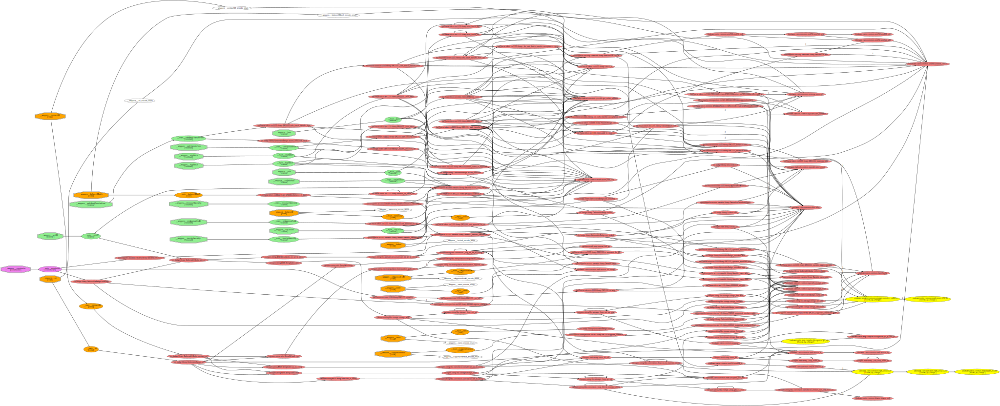

# Carbonable Library

## ✨ Presentation

At Carbonable, we believe that the best value investments value the planet. Carbonable empowers anyone to fight climate change, by financing nature’s regeneration, while earning a significant, long-term and growing yield. These badges represent the positive contribution to the Carbonable ecosystem and to the rewilding of planet Earth.

## 📖 Description

Carbonable badge is a ERC-1155 standard contract with ERC-5192 extension to provide soulbound property to the tokens. We add a locked status which allows to lock or unlock each token id individually (locked by default). Also, during the testnet phase we added the ability to re-set the base URI at any time to ensure everything is working as expected.

## 🛠️ Features

Contracts include the following standard features:
- ✨ Mintable
- 🔥 Burnable
- 🌐 Metadata
- 🪦 Soulbound

## 📈 Callgraph

See also the detailed [callgraph](../callgraphs/CarbonableBadge.gv) of the smart-contract.

