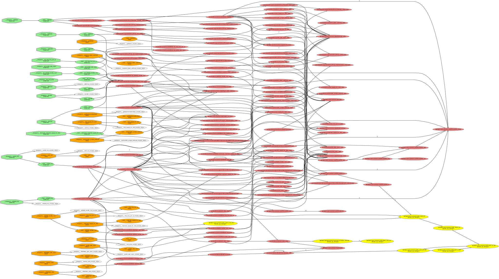

# Carbonable Minter

## ✨ Presentation

Through buying Carbonable NFTs, investors take part in the financing of a new nature-based decarbonization project, tied to an underlying CO2 sequestration capacity, and granting an ongoing financial reward resulting from the sales of carbon credit assets.

The minter is the decentralized smart-contract providing a permissionless and trustless mean to invest into the projects.

## 📖 Description

The minter is a dedicated contract to a single carbonable project contract, each time a new project is created an associated minter is also deployed. The minter is the definitive owner of the project contract, thus giving a property of decentralization to the project.

The purpose of the minter is to provide all required features required to make private, pre and public sales.

## 🔒 Private sale

The private sale is managed by handling a reserved supply substracted from the max supply that can only be airdropped to recipients.

Reserved supply can be called at any time and can only be decreased after the initial deployment.

## 👤 Presale

The presale is reserved to whitelisted addresses, this step is managed by a merkle tree mechanism (to save on-chain storage).

The total amount of token that can be purchased during this step relies on max supply, reserved supply but also whitelisted slots associated for each whitelisted addresses (handled during the merkle root generation).

The presale starts when the the merkle root is set to a not null value and continue while this condition is verified.

## 👥 Public sale

The public sale starts when the corresponding storage boolean becomes true.

The total amount of token that can be purchased during this step is the max supply minus the reserved supply minus the supply already minted.

## 📈 Callgraph

See also the detailed [callgraph](../callgraphs/CarbonableMinter.gv) of the smart-contract.

